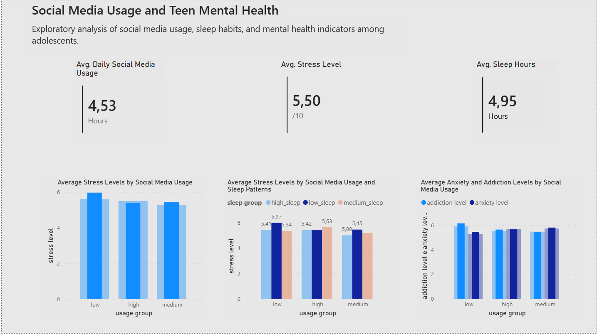

# Análise de Saúde Mental e Uso de Redes Sociais em Adolescentes

Análise exploratória de dados com o objetivo de investigar a relação entre uso de redes sociais e indicadores de saúde mental em adolescentes, considerando também fatores como sono, atividade física e comportamento digital.

---

## Sobre o projeto

O objetivo desta análise foi investigar a hipótese de que o uso excessivo de redes sociais estaria associado a impactos negativos na saúde mental de adolescentes.

Foram analisadas variáveis relacionadas ao tempo de uso, comportamento antes de dormir e indicadores psicológicos, buscando identificar padrões e possíveis associações.

---

## Perguntas investigadas

- O tempo diário de uso de redes sociais está associado a níveis mais altos de estresse, ansiedade e dependência?
- O uso de telas antes de dormir impacta a quantidade de sono?
- A quantidade de sono está relacionada à saúde mental?
- A atividade física atua como fator de proteção?

---

## Tecnologias utilizadas

- **Python**  
- **Pandas**  
- **NumPy**  
- **Matplotlib / Seaborn**  
- **Jupyter Notebook**  
- **Kaggle**
- **Power Bi**

---

## Etapas da análise

1. Carregamento e inspeção inicial do dataset  
2. Verificação de valores nulos e duplicados  
3. Classificação das variáveis (numéricas e categóricas)  
4. Criação de faixas de uso de redes sociais  
5. Análise de correlação entre variáveis  
6. Visualizações exploratórias  
7. Teste de hipóteses  

---

## Principais achados

- Não foram identificadas correlações estatisticamente relevantes entre:
  - Uso de redes sociais e indicadores de saúde mental  
  - Uso antes de dormir e horas de sono  
  - Atividade física e indicadores psicológicos  

- As análises visuais não apresentaram padrões claros ou tendências consistentes  

- As variáveis de saúde mental apresentaram distribuição praticamente uniforme  

---

## Insight principal

A ausência de relações significativas sugere que:

- As variáveis analisadas possuem baixa estrutura relacional  
- O uso de redes sociais, isoladamente, não explica os indicadores de saúde mental neste dataset  
- O fenômeno analisado é multifatorial e depende de variáveis não presentes nos dados  

---

## Limitações

- Possível natureza sintética ou simplificada do dataset  
- Ausência de variáveis relevantes (contexto social, econômico e psicológico)  
- Uso de análise baseada apenas em correlação linear  

---

## Próximos passos

- Reproduzir a análise utilizando SQL  
- Desenvolver dashboard no Power BI  
- Explorar abordagens não lineares e análise de interações entre variáveis  

---
## Dashboard 

## Considerações finais

Este projeto demonstra a importância da análise crítica de dados, evidenciando que nem todo dataset apresenta relações significativas e que conclusões devem sempre ser baseadas em evidências, não em suposições.

